# ECE 196 Fall 2023 Team Project Pulse Final Project: Heart Disease and Diagnosis Detector
# The Team
Sialoi Taa, Sara Mostafidi, Allison Moya

# Project Overview
## Problem Definition
Older aged people not knowing that they may have an underlying heart disease, more focused towards those with no medical background knowledge.
## Problem Solution
Heart Monitor with arrhythmia (aFib) Detection

## Demo Video
[ECE 196 Pulse Project: 
Fibi](https://youtu.be/l_U-TADhpTM?si=gZzMEEWPGDS88HhN)
## Milestones
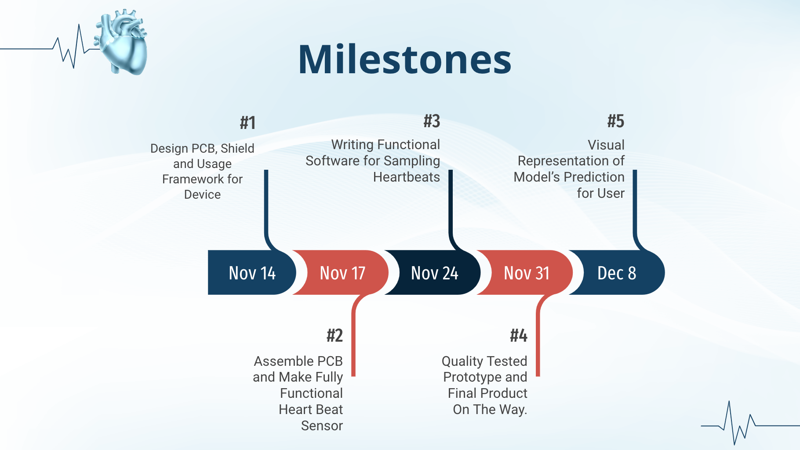

## Completed
1. Completed PCB and schematic design
2. Assembled PCB (except for photodiode)
3. Code for AFib detection
4. 3D Printed Shield
5. UI/UX/Mobile Application for User Results

# Heartbeat Pulse Sensor
## Images
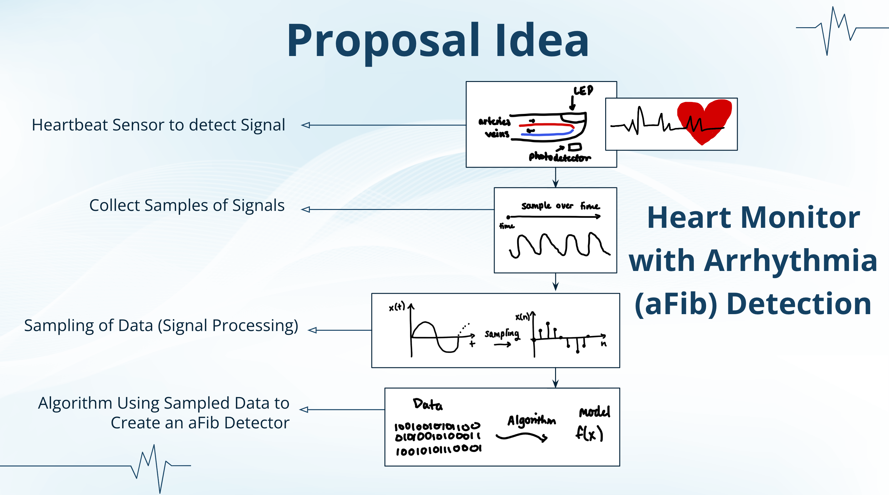

## Schematic
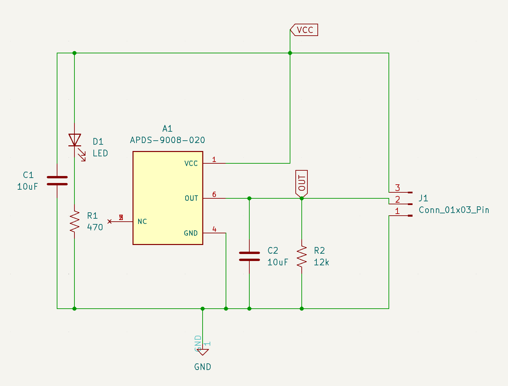

## PCB

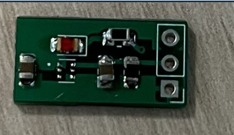

## Software and Hardware List
1. Arduino
2. Python
3. Swift
4. Photodiode
5. LED
6. ESP32
7. Resistor
8. Capacitor

# Prototype and Shield
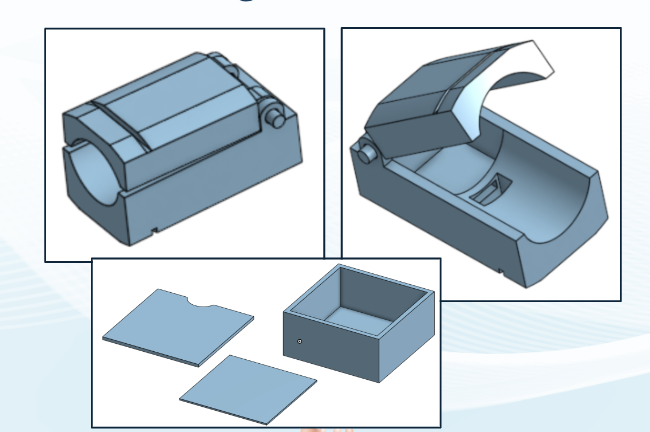

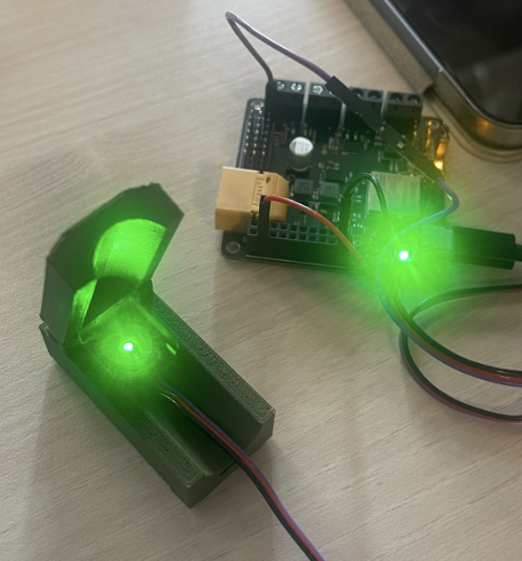
# Sampling for aFib Detection
## Flow Chart
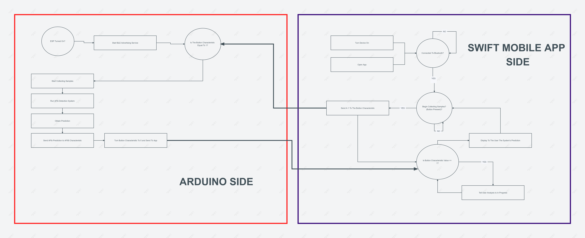  
Flow chart can also be found here: [CLICK HERE](https://mockitt.wondershare.com/flow/design/pblpxqq0awu9770s)
## Code
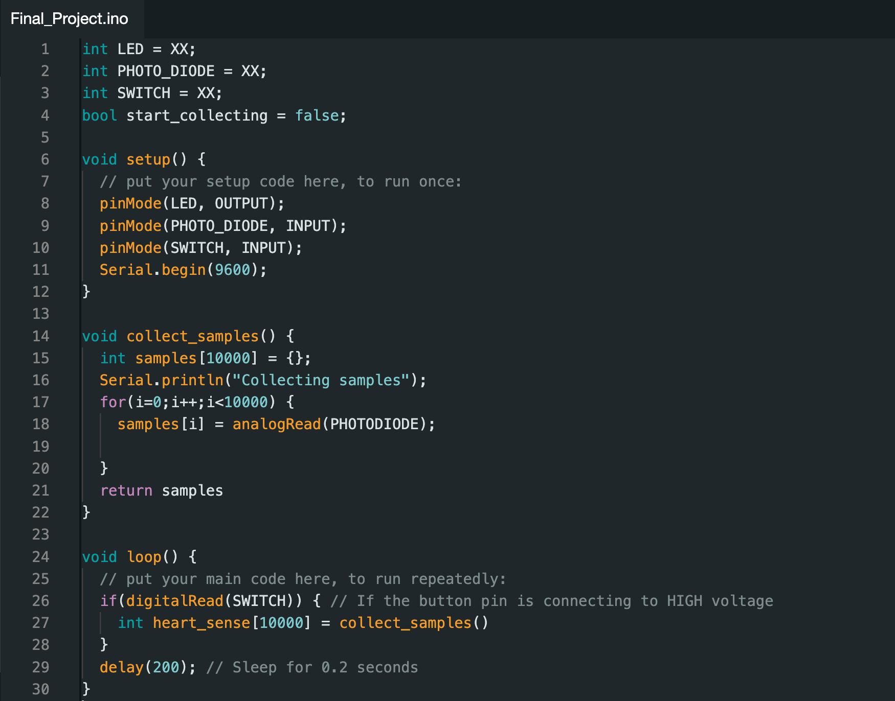
# UI/Application
First is our app that will be very easily downloadable for our target audience: the elderly.  
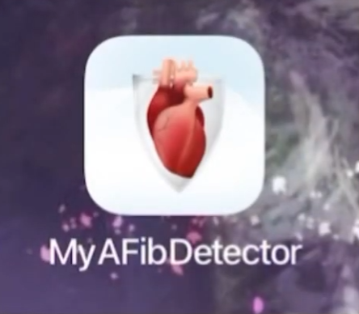  
  
After entering into the app, it'll begin searching for the device.  
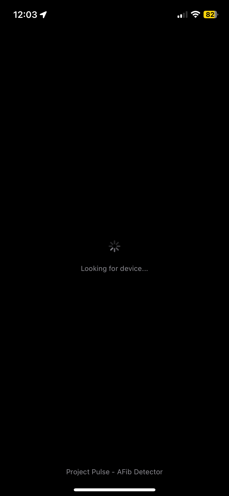  
  
Once connected to the device, this will be the home page where all of the options will be located. We have 2 buttons: Start Collection and Results.
Start Collection will begin the AFib prediction process while the Results button will show you the most recent results from the AFib detection processes.   
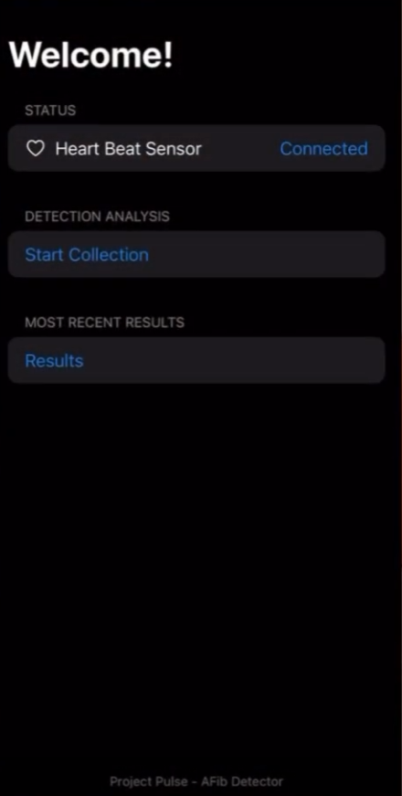  
  
This is what the app will look like when the AFib prediction process is acting:  
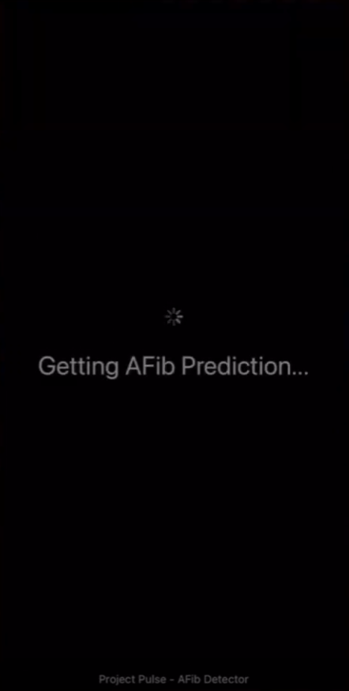  
  
After the process is finished, the user will be sent back to the home page and can see their results by pressing the Results button.  
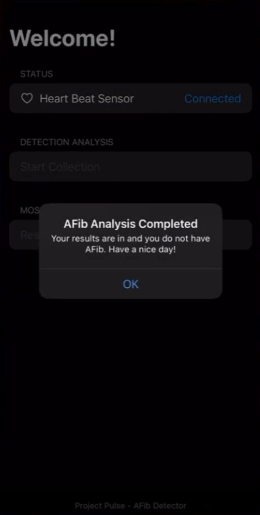  

# Final Presentation
[PRESENTATION](https://docs.google.com/presentation/d/1Bf_K1-Fuhnck8Ux5nZZ97LSzt35pcDPSmIBCwOtfqkg/edit?usp=sharing/)

# References, Citations, Helpful Resources
[Sensing Infosheet | CSDT](https://csdt.org/culture/performingarts/sensing-infosheet.html#:~:text=Photoplethysmography%20(PPG)%3A,result%20of%20each%20heart%20beat): Helps with visualizing how the user will use our device

[Heart rate versus heart rhythm](https://www.fibricheck.com/heart-rate-versus-heart-rhythm/): Helps with creating a prediction algorithm

[How to detect IR pulse using phototransistor and voltage comparator (subtracting constant light) - Electrical Engineering Stack Exchange](https://electronics.stackexchange.com/questions/464372/how-to-detect-ir-pulse-using-phototransistor-and-voltage-comparator-subtracting): Helps with understanding the process of detecting a heartbeat.

# Acknowledgements
Scripps Institution of Oceanography Engineers
TA's and Karcher :)
